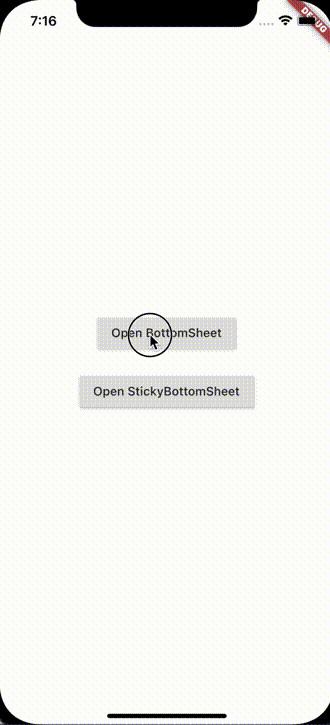
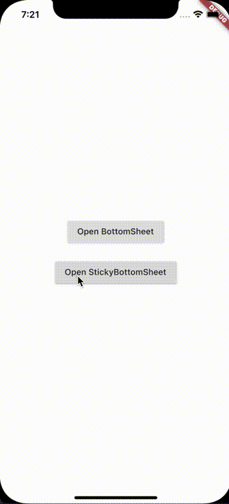

#### [SurfGear](https://github.com/surfstudio/SurfGear)

# bottom_sheet

Custom bottom sheet widget, that can resize by drag and then scroll.

## Usage

Main classes:
1. [FlexibleBottomSheetController](lib/src/flexible_bottom_sheet_controller.dart)
2. [FlexibleBottomSheetOwner](lib/src/flexible_bottom_sheet_owner.dart)
3. [BottomSheetRoute and Showing methods](lib/src/flexible_bottom_sheet_route.dart)

## Bottom Sheet

Flexible and scrollable bottom sheet.

You can show it if call `showFlexibleBottomSheet()`, then it will be show as popup like a modal
bottom sheet with resize by drag and scrollable.

Also you can use `FlexibleBottomSheetController` to show it.
For this call you must create `FlexibleBottomSheetController` and give to controller 

There are 2 type of BottomSheet:  
1. BottomSheet
2. StickyBottomSheet

#### Simple BottomSheet



To show bottomSheet, use :
```
showFlexibleBottomSheet(
  minHeight: 0,
  initHeight: 0.5,
  maxHeight: 1,
  context: context,
  builder: _buildBottomSheet,
  anchors: [0, 0.5, 1],
);

Widget _buildBottomSheet(
    BuildContext context,
    ScrollController scrollController,
    double bottomSheetOffset,
  ) {
    return SafeArea(
      child: Material(
        child: Container(
          child: ListView(
            ...
          ),
        ),
      ),
    );
  }
```
#### Sticky BottomSheet



To show sticky BottomSheet, use:  
**You should return SliverChildListDelegate from builder !!!**
```
showStickyFlexibleBottomSheet(
      minHeight: 0,
      initHeight: 0.5,
      maxHeight: 1,
      headerHeight: 200,
      context: context,
      backgroundColor: Colors.white,
      headerBuilder: (BuildContext context, double offset) {
        return Container(
          ...
        );
      },
      builder: (BuildContext context, double offset) {
        return SliverChildListDelegate(
          <Widget>[...],
        );
      },
      anchors: [0, 0.5, 1],
    );
```